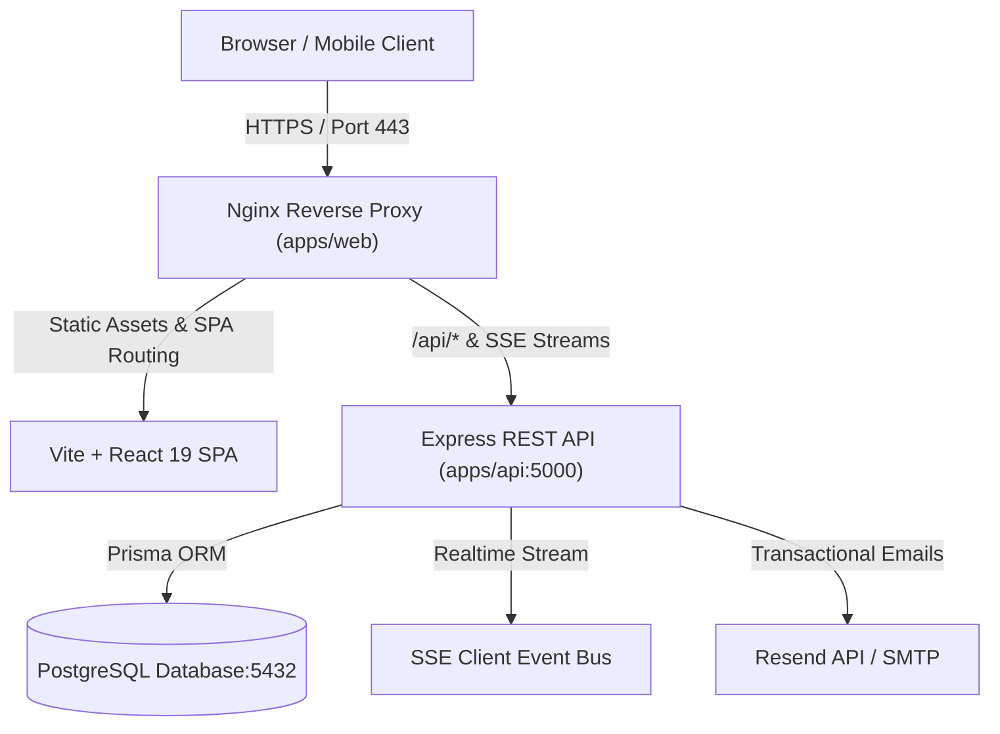

# Advisio Research Management System — Production Deployment Runbook

This document provides step-by-step instructions for deploying the Advisio Research Management Platform into staging and production environments.

---

## Architecture Overview



---

## 1. System Requirements & Prerequisites

| Requirement | Minimum | Recommended |
|---|---|---|
| **Operating System** | Ubuntu 22.04 LTS / Debian 12 / Alpine Linux | Ubuntu 24.04 LTS |
| **CPU** | 2 vCPU | 4 vCPU |
| **RAM** | 4 GB | 8 GB |
| **Disk Storage** | 20 GB SSD | 50 GB NVMe SSD |
| **Node.js** | v20.18.0+ LTS | v22.x LTS |
| **Docker & Compose** | Docker 24.x + Compose v2.20+ | Latest stable Docker Engine |
| **PostgreSQL** | PostgreSQL 15+ | PostgreSQL 16 with `citext` & `pgcrypto` |

---

## 2. Environment Variables Configuration

Copy `.env.example` to `.env` in the root directory:

```bash
cp .env.example .env
```

### Production Variable Checklist

| Variable | Description | Example / Recommended Value |
|---|---|---|
| `NODE_ENV` | Runtime environment | `production` |
| `PORT` | API listening port | `5000` |
| `DATABASE_URL` | PostgreSQL connection string | `postgresql://advisio_admin:<SECURE_PASSWORD>@postgres:5432/advisio_production?schema=public` |
| `JWT_SECRET` | Secret key for signing auth tokens (min 32 chars) | `openssl rand -base64 48` |
| `CORS_ORIGIN` | Allowed web origin for API requests | `https://advisio.youruniversity.edu.ph` |
| `VITE_API_URL` | API base URL for client build | `https://advisio.youruniversity.edu.ph/api` |
| `RESEND_API_KEY` | Resend API key for transactional emails | `re_123456789...` (Optional, mock delivery used if blank) |
| `EMAIL_FROM` | Verified sender email address | `Advisio System <notifications@youruniversity.edu.ph>` |

---

## 3. Option A: Single-Command Docker Deployment (Recommended)

The easiest and most reliable way to run Advisio in production is via Docker Compose.

### Step 1: Clone the repository
```bash
git clone https://github.com/heisenberg1122/Advisio_Prototype_Updated.git /var/www/advisio
cd /var/www/advisio
```

### Step 2: Configure Production Environment
```bash
cp .env.example .env
nano .env   # Fill in production secrets, strong DB passwords, and JWT_SECRET
```

### Step 3: Launch Containers
```bash
docker compose -f docker-compose.prod.yml up -d --build
```

### Step 4: Run Initial Database Migration & Seeding
Once the database container is healthy:
```bash
# Apply initial Prisma baseline migrations
docker compose -f docker-compose.prod.yml exec api npx prisma migrate deploy

# Seed default super admin, adviser, and student accounts
docker compose -f docker-compose.prod.yml exec api npm run seed --workspace=@research-management/database
```

### Step 5: Verify Containers
```bash
docker compose -f docker-compose.prod.yml ps
```
All three services (`advisio-postgres`, `advisio-api`, and `advisio-web`) should show status `Up` or `healthy`.

---

## 4. Option B: Bare-Metal / Cloud VM Deployment

If deploying without Docker on an Ubuntu/Debian VM:

### Step 1: Install Dependencies
```bash
curl -fsSL https://deb.nodesource.com/setup_20.x | sudo -E bash -
sudo apt-get install -y nodejs postgresql postgresql-contrib nginx certbot python3-certbot-nginx
```

### Step 2: Configure PostgreSQL
```bash
sudo -u postgres psql
```
```sql
CREATE DATABASE advisio_production;
CREATE USER advisio_admin WITH ENCRYPTED PASSWORD 'your_strong_password_here';
GRANT ALL PRIVILEGES ON DATABASE advisio_production TO advisio_admin;
\c advisio_production
CREATE EXTENSION IF NOT EXISTS "citext";
CREATE EXTENSION IF NOT EXISTS "pgcrypto";
\q
```

### Step 3: Install & Build Monorepo
```bash
git clone https://github.com/heisenberg1122/Advisio_Prototype_Updated.git /var/www/advisio
cd /var/www/advisio
npm ci
cp .env.example .env
# Edit .env with your PostgreSQL credentials and secrets

# Generate Prisma client, build all packages, run tests
npm run build
npm run test
```

### Step 4: Apply Database Migrations & Seeds
```bash
npx prisma migrate deploy --schema=packages/database/prisma/schema.prisma
npm run seed --workspace=@research-management/database
```

### Step 5: Run API Service with PM2
```bash
sudo npm install -g pm2
pm2 start apps/api/dist/index.js --name advisio-api --env production
pm2 save
pm2 startup
```

### Step 6: Configure Nginx Reverse Proxy & Static Host
Create `/etc/nginx/sites-available/advisio`:
```nginx
server {
    listen 80;
    server_name advisio.youruniversity.edu.ph;

    root /var/www/advisio/apps/web/dist;
    index index.html;

    # Static assets with long cache duration
    location /assets/ {
        expires 1y;
        add_header Cache-Control "public, max-age=31536000, immutable";
        try_files $uri =404;
    }

    # API Proxy & Server-Sent Events (SSE)
    location /api/ {
        proxy_pass http://127.0.0.1:5000/api/;
        proxy_http_version 1.1;
        proxy_set_header Host $host;
        proxy_set_header X-Real-IP $remote_addr;
        proxy_set_header X-Forwarded-For $proxy_add_x_forwarded_for;
        proxy_set_header X-Forwarded-Proto $scheme;

        # Crucial for SSE real-time events
        proxy_set_header Connection '';
        proxy_buffering off;
        proxy_cache off;
        chunked_transfer_encoding off;
        proxy_read_timeout 86400s;
    }

    # SPA routing fallback
    location / {
        try_files $uri $uri/ /index.html;
    }
}
```
Enable site and acquire SSL:
```bash
sudo ln -s /etc/nginx/sites-available/advisio /etc/nginx/sites-enabled/
sudo nginx -t && sudo systemctl reload nginx
sudo certbot --nginx -d advisio.youruniversity.edu.ph
```

---

## 5. Seeded Default Accounts

The database seed script initializes the following role accounts for testing and initial platform configuration:

| Role | Email | Default Password | Initial Action Required |
|---|---|---|---|
| **System Admin** | `admin@advisio.edu.ph` | `Admin@12345` | Change password immediately upon first login |
| **Faculty Adviser** | `adviser@advisio.edu.ph` | `Adviser@12345` | Configure department & advising capacity |
| **Student Researcher**| `student@advisio.edu.ph` | `Student@12345` | Join or register research group |

> [!CAUTION]
> In a public production environment, change the default passwords immediately using the Admin dashboard or database management tools.

---

## 6. Health Checks & Verification

Verify the deployment with these automated health endpoints:

```bash
# 1. API Health Inspection (Checks database connectivity)
curl -i https://advisio.youruniversity.edu.ph/api/health

# Expected response:
# HTTP/1.1 200 OK
# {"status":"healthy","timestamp":"...","service":"Advisio Research Management API","database":"connected"}

# 2. Real-time SSE Connection Metrics
curl -i https://advisio.youruniversity.edu.ph/api/realtime/status

# Expected response:
# HTTP/1.1 200 OK
# {"status":"ok","activeConnections":0}
```

---

## 7. Backup & Recovery Procedures

### Database Backup
```bash
# Automated daily backup script
pg_dump -U advisio_admin -d advisio_production -F c -b -v -f "/backups/advisio_$(date +\%Y\%m\%d_\%H\%M\%S).dump"
```

### Database Restore
```bash
pg_restore -U advisio_admin -d advisio_production -v "/backups/advisio_backup_name.dump"
```

---

## 8. Troubleshooting Common Issues

1. **502 Bad Gateway on `/api/*`:**
   - Verify the Express backend is running: `docker compose ps` or `pm2 status`.
   - Check API logs: `docker compose logs api` or `pm2 logs advisio-api`.
2. **SSE disconnects after 60 seconds:**
   - Ensure Nginx configuration includes `proxy_buffering off;` and `proxy_read_timeout 86400s;`.
3. **Database connection refused:**
   - Confirm `DATABASE_URL` matches the internal Docker network name (`postgres`) or external database IP.
   - Ensure PostgreSQL extensions `citext` and `pgcrypto` are installed.
